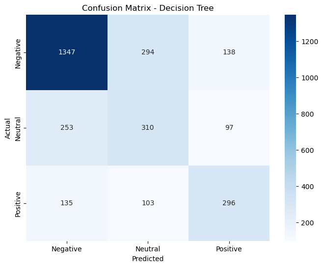

# Twitter-Sentiment-Analysis

**Authors**: Franko Ndou

## Overview

Just like any business, airlines have customers to please. Its cruical to make sure that every passenger is left with a positive experience. Social media has allowed us and others to be able to publicly express their opinions about many things including experiences and sentiment towards companies. This is incredibly useful feedback for companies as they can see what the most common complaints are as well as other factors.


## Business Problem

The CCO at JetBlue Airways is closely monitoring social media to understand customer sentiment. They've observed a surge in negative tweets and a decrease in overall customer satisfaction scores in recent months. This trend has raised concerns within JetBlue's management team, as they are committed to providing exceptional service.

The CCO believes that analyzing the sentiment of user tweets can provide valuable insights into the specific issues and areas where JetBlue may be falling short of meeting customer expectations. They are particularly interested in understanding the sentiments associated with JetBlue and how it compares to competitors in the market. To address this, the CCO wants to commission a sentiment analysis NLP model and has chosen to hire you for this project. The model should perform the following tasks:

* Sentiment Classification: The model should classify user sentiment in tweets as Positive, Neutral, or Negative, providing an overall sentiment assessment.
<br>
* Focus on Precision: We want to be able to consistently predict as many True Negatives as possible so focusing on precision is a must.

The sentiment analysis NLP model that you will develop plays a crucial role in helping the CCO and the JetBlue team better understand customer sentiment, pinpoint trouble spots, and make data-driven decisions to enhance the passenger experience and maintain their competitive edge in the airline industry.

## Data

The data was made available on [Kaggle](https://www.kaggle.com/datasets/crowdflower/twitter-airline-sentiment) . The twitter data was scraped from February 2015 for 2 weeks and contains over 14K tweets and their sentiment (positive, neutral, or negative) regarding 6 major airlines in the US.


<br>

<br>

<br>


## Methods

Due to the nature of this project, I utilized an NLP model to classify user sentiment of the afformentioned airline data. I had tested both forms of vectorization (Count Vectorization and TF-IDF) to test the effectiveness on a model to model basis. I had experimented with a baseline of multiple models, five unique models to be specific, with two seperate vectorizors. However I only hyperparameter tuned 4 models in total (The two highest performing baseline models for each vectorizor) due to a lack of computational power.

## Baseline Models

### TF-IDF Vectorization

```
LogisticRegression  Precision Score: 72.84%
              precision    recall  f1-score   support

           0       0.80      0.85      0.82      1677
           1       0.60      0.53      0.56       748
           2       0.69      0.67      0.68       548

    accuracy                           0.73      2973
   macro avg       0.70      0.68      0.69      2973
weighted avg       0.73      0.73      0.73      2973

MultinomialNB  Precision Score: 76.93%
              precision    recall  f1-score   support

           0       0.87      0.82      0.84      1905
           1       0.44      0.59      0.51       493
           2       0.70      0.65      0.68       575

    accuracy                           0.75      2973
   macro avg       0.67      0.69      0.68      2973
weighted avg       0.77      0.75      0.76      2973

DecisionTreeClassifier  Precision Score: 65.26%
              precision    recall  f1-score   support

           0       0.76      0.78      0.77      1735
           1       0.47      0.44      0.45       707
           2       0.55      0.56      0.56       531

    accuracy                           0.66      2973
   macro avg       0.59      0.59      0.59      2973
weighted avg       0.65      0.66      0.65      2973

RandomForestClassifier  Precision Score: 73.8%
              precision    recall  f1-score   support

           0       0.85      0.79      0.82      1906
           1       0.51      0.56      0.53       600
           2       0.59      0.67      0.63       467

    accuracy                           0.73      2973
   macro avg       0.65      0.67      0.66      2973
weighted avg       0.74      0.73      0.73      2973

GradientBoostingClassifier  Precision Score: 67.51%
              precision    recall  f1-score   support

           0       0.70      0.85      0.77      1461
           1       0.68      0.44      0.53      1030
           2       0.58      0.65      0.61       482

    accuracy                           0.68      2973
   macro avg       0.66      0.65      0.64      2973
weighted avg       0.68      0.68      0.66      2973

XGBClassifier  Precision Score: 71.65%
              precision    recall  f1-score   support

           0       0.79      0.84      0.82      1683
           1       0.61      0.51      0.56       787
           2       0.62      0.66      0.64       503

    accuracy                           0.72      2973
   macro avg       0.68      0.67      0.67      2973
weighted avg       0.72      0.72      0.72      2973

```


<br>

<br>

<br>

<br>

<br>

<br>


### Count Vectorization

```
LogisticRegression  Precision Score: 72.95%
              precision    recall  f1-score   support

           0       0.81      0.85      0.83      1695
           1       0.59      0.54      0.56       717
           2       0.68      0.65      0.66       561

    accuracy                           0.73      2973
   macro avg       0.69      0.68      0.68      2973
weighted avg       0.73      0.73      0.73      2973

MultinomialNB  Precision Score: 79.42%
              precision    recall  f1-score   support

           0       0.91      0.79      0.84      2056
           1       0.43      0.64      0.52       447
           2       0.63      0.71      0.67       470

    accuracy                           0.75      2973
   macro avg       0.66      0.71      0.68      2973
weighted avg       0.79      0.75      0.77      2973

DecisionTreeClassifier  Precision Score: 59.0%
              precision    recall  f1-score   support

           0       0.64      0.80      0.71      1442
           1       0.52      0.41      0.46       823
           2       0.57      0.43      0.49       708

    accuracy                           0.60      2973
   macro avg       0.58      0.55      0.55      2973
weighted avg       0.59      0.60      0.59      2973

RandomForestClassifier  Precision Score: 67.25%
              precision    recall  f1-score   support

           0       0.75      0.81      0.78      1632
           1       0.53      0.48      0.51       722
           2       0.64      0.55      0.59       619

    accuracy                           0.68      2973
   macro avg       0.64      0.62      0.63      2973
weighted avg       0.67      0.68      0.67      2973

GradientBoostingClassifier  Precision Score: 67.49%
              precision    recall  f1-score   support

           0       0.71      0.84      0.77      1506
           1       0.66      0.45      0.54       963
           2       0.59      0.63      0.61       504

    accuracy                           0.68      2973
   macro avg       0.66      0.64      0.64      2973
weighted avg       0.67      0.68      0.67      2973

XGBClassifier  Precision Score: 71.41%
              precision    recall  f1-score   support

           0       0.79      0.83      0.81      1685
           1       0.61      0.52      0.56       771
           2       0.62      0.64      0.63       517

    accuracy                           0.72      2973
   macro avg       0.67      0.67      0.67      2973
weighted avg       0.71      0.72      0.72      2973

```

<br>

<br>

<br>

<br>

<br>

<br>

<br>


## Cross-Validation

### TF-IDF 

```
============================== LogisticRegression ==============================
Precision Scores:
[0.81909721 0.80449119 0.8617358  0.8479915  0.8603556 ]
Mean Precision: 83.87%
Standard Deviation: 2.30%


============================== MultinomialNB ==============================
Precision Scores:
[0.813952   0.81972017 0.8543575  0.83424737 0.85947591]
Mean Precision: 83.64%
Standard Deviation: 1.81%


============================== DecisionTreeClassifier ==============================
Precision Scores:
[0.73980553 0.75917857 0.85173701 0.84156997 0.84334706]
Mean Precision: 80.71%
Standard Deviation: 4.76%


============================== RandomForestClassifier ==============================
Precision Scores:
[0.84180334 0.84203078 0.92126914 0.91119885 0.92210788]
Mean Precision: 88.77%
Standard Deviation: 3.76%


============================== GradientBoostingClassifier ==============================
Precision Scores:
[0.70535662 0.73721904 0.78932189 0.78332205 0.79241155]
Mean Precision: 76.15%
Standard Deviation: 3.45%


============================== XGBClassifier ==============================
Precision Scores:
[0.76964611 0.79166649 0.86490246 0.86378973 0.86379831]
Mean Precision: 83.08%
Standard Deviation: 4.15%
```

### Count Vectorization

```
============================== LogisticRegression ==============================
Precision Scores:
[0.69409436 0.72064579 0.81109406 0.80796113 0.82469478]
Mean Precision: 77.17%
Standard Deviation: 5.35%


============================== MultinomialNB ==============================
Precision Scores:
[0.68358851 0.69163927 0.74652675 0.73504734 0.67874809]
Mean Precision: 70.71%
Standard Deviation: 2.80%


============================== DecisionTreeClassifier ==============================
Precision Scores:
[0.61608355 0.65731182 0.78505173 0.76506145 0.77881292]
Mean Precision: 72.05%
Standard Deviation: 6.99%


============================== RandomForestClassifier ==============================
Precision Scores:
[0.67692562 0.6986353  0.80925956 0.79998089 0.8090173 ]
Mean Precision: 75.88%
Standard Deviation: 5.85%


============================== GradientBoostingClassifier ==============================
Precision Scores:
[0.67303986 0.69065099 0.77438445 0.77686107 0.78111248]
Mean Precision: 73.92%
Standard Deviation: 4.72%


============================== XGBClassifier ==============================
Precision Scores:
[0.68620356 0.71397281 0.79770611 0.79200361 0.80950869]
Mean Precision: 75.99%
Standard Deviation: 4.99%
```

## Trained Models

I Decided to only Train the top performing models of both Vectorizations to save time.

###  TF-IDF

Best Hyper-Parameters for Random Forests:
```
Best Hyperparameters: {'max_depth': None, 'min_samples_leaf': 1, 'min_samples_split': 2, 'n_estimators': 300}
Best Precision Score: 0.8872593898880913
Precision on Test Set: 0.7153961313817274
```
Best Hyper-Parameters for Multinomial NB:
```
Best Hyperparameters: {'alpha': 0.001}
Best Precision Score: 0.8794520288324238
Precision on Test Set: 0.6917885729838786
```
### Count Vectorization

Best Hyper-Parameters for Logistic Regression:
```
Best Hyperparameters: {'C': 1.0, 'penalty': 'l2', 'solver': 'liblinear'}
Best Precision Score: 0.7748965088573446
Precision on Test Set: 0.7511136750037432
```
Multinomial NB:
```
Best Hyperparameters: {'alpha': 0.01}
Best Precision Score: 0.7277756939205042
Precision on Test Set: 0.7213838350338693
```

Trained Random Forest Model:
<br>


Trained Multinomial NB Model (TF-IDF):
<br>


Trained Multinomial NB Model (Count Vec.):
<br>


Trained Logistic Regression Model:
<br>


ROC for all models:
<br>


## Conclusion

* Logisitc Regression was consistently the best performing model however it not extremely time efficient. It take me about 5 hour to run each model which is extremely time consuming. Compared to our other models I dont believe its worth the wait to save an extra percent due to the nature of our dataset. 
   <br>
* TF-IDF had better cross-validation scores and lower variance but Count Vectorization did out perform on certain models such as Multinominal. 
   <br>
* TF-IDF Vectorization seems to work best with our current dataset. I found that the models actually ran quicker for TF-IDF as well as the scores tended to be better. Count Vectorization seemed to allow some overfitting as the test scores did not match the train set very well
   <br>

### Recommendations
* If we are looking for the best scores possible I would suggest using the Logistic Regression model. However I would incorporate the use of some sort of cloud service that would allow for more time efficient testing
   <br> 
* MultinominalNB was the fastest performing model that had acceptable test scores. If we were working on a time constraint I would recommend that 
   <br>
* This dataset was fairly imbalanced. Assuming you did not want to tamper with anything I would suggest using some form of boosting algorithm. (XGBoost, Gradient Boosting)


### Next Steps
To continue improving and expanding this project, here are some suggested next steps:

* Cloud Deployment: I would consider deploying the machine learning model to a cloud service, such as AWS or Saturn Cloud. This will enable me to conduct more extensive hyperparameter tuning and make the model accessible for real-world predictions.
  <br>
* Establish a Comprehensive Model Training Pipeline: Creating a well-defined model training pipeline is crucial for managing the end-to-end machine learning process efficiently. This pipeline should encompass various stages, from data preprocessing to model evaluation. Here's a breakdown of key components:
  <br>
* Due to time constraints, I was only able to fully hyperparameter tune 4 models, which were the highest performing baseline models. However I left the code for all the other models.
  <br>
* Neural networks are known for their performance. Through using Tensorflow and Keras we could optimize a model that would allow us to be able to predict with a higher precision and accuracy.
  <br>
* We could expand our model by also predicting what caused the negative review as well. We can predict if a review is negative or not, however to predicit if a review is negative and why would significantly contribute to JetBlue as a whole
  

## For More Information

Please review the full analysis in [my Jupyter Notebook](./code/Airline Sentiment Analysis.ipynb) or my [presentation](./Airline Sentiment Analysis (NLP).pdf).

For any additional questions, please contact me:

**Franko Ndou & frankondou@gmail.com**

## Repository Structure

Describe the structure of your repository and its contents, for example:

```
├── code
│   └── Airline Sentiment Analysis.ipynb
├── images
├── README.md
├── .gitignore
└── Airline Sentiment Analysis (NLP).pdf
```
